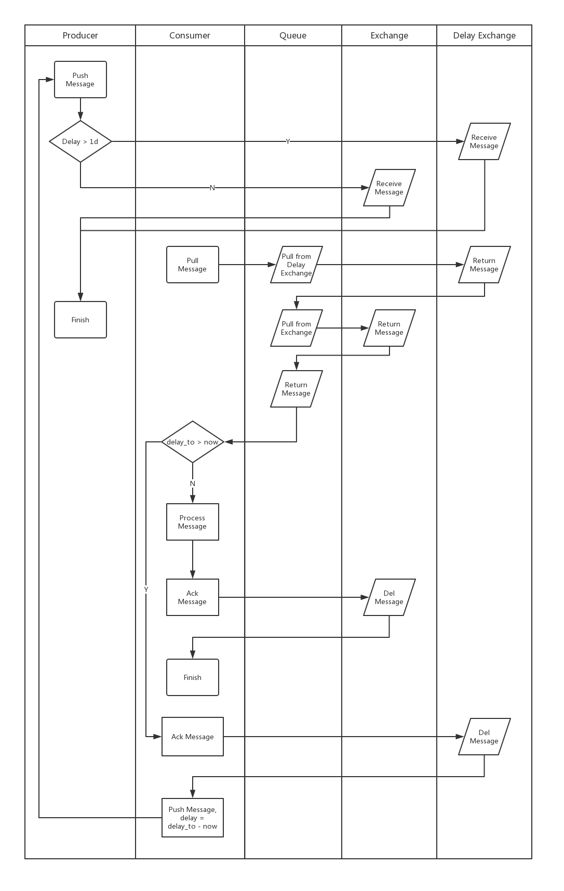

RabbitMQ Queue driver for Laravel
======================
[](https://packagist.org/packages/luoxiaojun/laravel-queue-rabbitmq)
[](https://travis-ci.org/luoxiaojun/laravel-queue-rabbitmq)
[](https://packagist.org/packages/luoxiaojun/laravel-queue-rabbitmq)
[](https://packagist.org/packages/luoxiaojun/laravel-queue-rabbitmq)

## Installation

You can install this package via composer using this command:

```
composer require luoxiaojun/laravel-queue-rabbitmq:dev-master -vvv
```

The package will automatically register itself using Laravel auto-discovery.

Setup connection in `config/queue.php`

```php
'connections' => [
    // ...
    'rabbitmq' => [
        'driver' => 'rabbitmq',
    
        'worker' => 'default',
    
        'dsn' => env('RABBITMQ_DSN', null),
    
        /*
         * Could be one a class that implements \Interop\Amqp\AmqpConnectionFactory for example:
         *  - \VladimirYuldashev\LaravelQueueRabbitMQ\Queue\Lib\Ext\AmqpConnectionFactory if you install enqueue/amqp-ext
         *  - \VladimirYuldashev\LaravelQueueRabbitMQ\Queue\Lib\Amqp\AmqpConnectionFactory if you install enqueue/amqp-lib
         */
        'factory_class' => env('RABBITMQ_CONN_FACTORY', \VladimirYuldashev\LaravelQueueRabbitMQ\Queue\Lib\Ext\AmqpConnectionFactory::class),
    
        'host' => env('RABBITMQ_HOST', '127.0.0.1'),
        'port' => env('RABBITMQ_PORT', 5672),
    
        'vhost' => env('RABBITMQ_VHOST', '/'),
        'login' => env('RABBITMQ_LOGIN', 'guest'),
        'password' => env('RABBITMQ_PASSWORD', 'guest'),
    
        //For Aliyun
        'aliyun_access_key' => env('RABBITMQ_ALIYUN_AK'),
        'aliyun_access_secret' => env('RABBITMQ_ALIYUN_AS'),
        'aliyun_resouce_owner_id' => intval(env('RABBITMQ_ALIYUN_OWNER')),
        'max_delay' => intval(env('RABBITMQ_MAX_DELAY', 86400000)), //ms
        'delay_strategy' => \Enqueue\AmqpTools\RabbitMqDelayPluginDelayStrategy::class, // or null for Aliyun
    
        'queue' => env('QUEUE_NAME', 'default'),
    
        'queue_name_prefix' => env('RABBITMQ_QUEUE_NAME_PREFIX'),
    
        'persisted' => boolval(env('RABBITMQ_PERSISTED', false)), //only for amqp-ext
    
        'options' => [
    
            'producer' => [
                'queueTopicExchangeMapping' => [
                    'test_queue' => [
                        'topic' => 'test_topic', // string, default is queue name
                        'exchange' => 'test_exchange', //string, default is global name or queue name
                    ],
                ],
    
                'retry_on_connect_error' => boolval(env('RABBITMQ_RETRY_ON_CONN_ERROR', true)),
                
                'aggQueue' => [
                    //
                ],
            ],
    
            'consumer' => [
                'queueTopicExchangeMapping' => [
                    'test_queue' => [
                        [
                            'topic' => 'test_topic', // string or array, default is queue name
                            'exchange' => 'test_exchange', //string, default is global name or queue name
                        ],
                    ],
                ],
                'queueJobMapping' => [
                    'test_queue' => [
                        '^test_topic$' => 'TestJob',
                    ],
                    'test_queue2' => 'TestJob',
                ],
            ],
    
            'exchange' => [
    
                'name' => env('RABBITMQ_EXCHANGE_NAME'),
    
                'exchange_name_prefix' => env('RABBITMQ_EXCHANGE_NAME_PREFIX'),
    
                'routing_key_prefix' => env('RABBITMQ_ROUTING_KEY_PREFIX'),
    
                /*
                * Determine if exchange should be created if it does not exist.
                */
                'declare' => env('RABBITMQ_EXCHANGE_DECLARE', true),
    
                //后缀为-delay的exchange也需要单独配置
                'declareMapping' => [
                    'test_exchange' => false,
                ],
    
                /*
                * Read more about possible values at https://www.rabbitmq.com/tutorials/amqp-concepts.html
                */
                'type' => env('RABBITMQ_EXCHANGE_TYPE', \Interop\Amqp\AmqpTopic::TYPE_TOPIC),
                'passive' => env('RABBITMQ_EXCHANGE_PASSIVE', false),
                'durable' => env('RABBITMQ_EXCHANGE_DURABLE', true),
                'auto_delete' => env('RABBITMQ_EXCHANGE_AUTODELETE', false),
                'arguments' => env('RABBITMQ_EXCHANGE_ARGUMENTS'),
    
                //后缀为-delay的exchange也需要单独配置
                'optionsMapping' => [
                    'test_exchange' => [
                        'type' => env('RABBITMQ_EXCHANGE_TYPE', \Interop\Amqp\AmqpTopic::TYPE_TOPIC),
                        'passive' => env('RABBITMQ_EXCHANGE_PASSIVE', false),
                        'durable' => env('RABBITMQ_EXCHANGE_DURABLE', true),
                        'auto_delete' => env('RABBITMQ_EXCHANGE_AUTODELETE', false),
                        'arguments' => env('RABBITMQ_EXCHANGE_ARGUMENTS'),
                    ],
                ],
            ],
    
            'queue' => [
    
                /*
                * Determine if queue should be created if it does not exist.
                */
                'declare' => env('RABBITMQ_QUEUE_DECLARE', true),
    
                'declareMapping' => [
                    'test_queue' => false,
                ],
    
                /*
                * Determine if queue should be binded to the exchange created.
                */
                'bind' => env('RABBITMQ_QUEUE_DECLARE_BIND', true),
    
                //后缀为-delay的exchange也需要单独配置
                'bindMapping' => [
                    'test_queue' => [
                        'test_exchange' => [
                            'test_topic' => true,
                        ],
                    ],
                ],
    
                /*
                * Read more about possible values at https://www.rabbitmq.com/tutorials/amqp-concepts.html
                */
                'passive' => env('RABBITMQ_QUEUE_PASSIVE', false),
                'durable' => env('RABBITMQ_QUEUE_DURABLE', true),
                'exclusive' => env('RABBITMQ_QUEUE_EXCLUSIVE', false),
                'auto_delete' => env('RABBITMQ_QUEUE_AUTODELETE', false),
                'arguments' => env('RABBITMQ_QUEUE_ARGUMENTS'),
    
                'optionsMapping' => [
                    'test_queue' => [
                        'passive' => env('RABBITMQ_QUEUE_PASSIVE', false),
                        'durable' => env('RABBITMQ_QUEUE_DURABLE', true),
                        'exclusive' => env('RABBITMQ_QUEUE_EXCLUSIVE', false),
                        'auto_delete' => env('RABBITMQ_QUEUE_AUTODELETE', false),
                        'arguments' => env('RABBITMQ_QUEUE_ARGUMENTS'),
                    ],
                ],
            ],
        ],
    
        /*
         * Determine the number of seconds to sleep if there's an error communicating with rabbitmq
         * If set to false, it'll throw an exception rather than doing the sleep for X seconds.
         */
        'sleep_on_error' => env('RABBITMQ_ERROR_SLEEP', false),
    
        /*
         * Optional SSL params if an SSL connection is used
         */
        'ssl_params' => [
            'ssl_on' => env('RABBITMQ_SSL', false),
            'cafile' => env('RABBITMQ_SSL_CAFILE', null),
            'local_cert' => env('RABBITMQ_SSL_LOCALCERT', null),
            'local_key' => env('RABBITMQ_SSL_LOCALKEY', null),
            'verify_peer' => env('RABBITMQ_SSL_VERIFY_PEER', true),
            'passphrase' => env('RABBITMQ_SSL_PASSPHRASE', null),
        ],
    ],
    // ...    
],
```

## Laravel Usage

Once you completed the configuration you can use Laravel Queue API. If you used other queue drivers you do not need to change anything else. If you do not know how to use Queue API, please refer to the official Laravel documentation: http://laravel.com/docs/queues

## Lumen Usage

For Lumen usage the service provider should be registered manually as follow in `bootstrap/app.php`:

```php
$app->register(VladimirYuldashev\LaravelQueueRabbitMQ\LaravelQueueRabbitMQServiceProvider::class);
```

## Limitations

1. Retry command is not supported

## Delay > 1d (Only for Aliyun)



## Using other AMQP transports

The package uses [enqueue/amqp-lib](https://github.com/php-enqueue/enqueue-dev/blob/master/docs/transport/amqp_lib.md) transport which is based on [php-amqplib](https://github.com/php-amqplib/php-amqplib). 
There is possibility to use any [amqp interop](https://github.com/queue-interop/queue-interop#amqp-interop) compatible transport, for example `enqueue/amqp-ext` or `enqueue/amqp-bunny`.
Here's an example on how one can change the transport to `enqueue/amqp-bunny`.

First, install desired transport package:

```bash
composer require enqueue/amqp-bunny:^0.8
```
  
Change the factory class in `config/queue.php`:

```php
    // ...
    'connections' => [
        'rabbitmq' => [
            'driver' => 'rabbitmq',
            'factory_class' => Enqueue\AmqpBunny\AmqpConnectionFactory::class,
        ],
    ],
```

## Testing

Setup RabbitMQ using `docker-compose`:
```bash
docker-compose up -d
```

Run tests:

``` bash
composer test
```

## Contribution

You can contribute to this package by discovering bugs and opening issues. Please, add to which version of package you create pull request or issue. (e.g. [5.2] Fatal error on delayed job)
